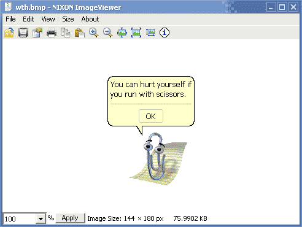



## ImageViewer

### Description

A simple image viewer that: opens, saves, prints, views properties of, manages, copies, pastes, pans, checks the size of, magnifies, and scales images.
 
### More Info
 

             |
---                |---
**Submitted On**   |2006-08-22 21:15:02
**By**             |[NIXON Software](https://github.com/Planet-Source-Code/PSCIndex/blob/master/ByAuthor/nixon-software.md)
**Level**          |Beginner
**User Rating**    |4.0 (16 globes from 4 users)
**Compatibility**  |VB 6\.0
**Category**       |[Graphics](https://github.com/Planet-Source-Code/PSCIndex/blob/master/ByCategory/graphics__1-46.md)
**World**          |[Visual Basic](https://github.com/Planet-Source-Code/PSCIndex/blob/master/ByWorld/visual-basic.md)
**Archive File**   |[ImageViewe2015318232006\.zip](https://github.com/Planet-Source-Code/nixon-software-imageviewer__1-65910/archive/master.zip)

